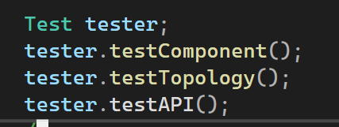
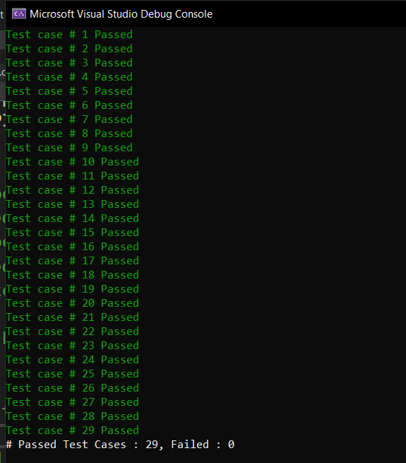
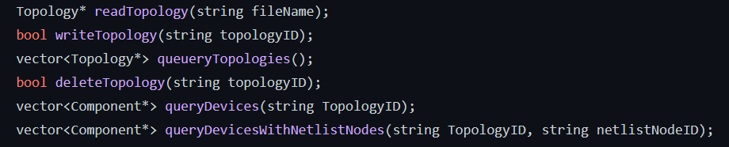
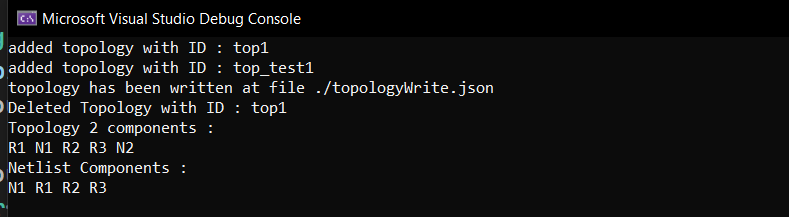

# Topology API

This is an API that is used to create topologies with difference electronic components

## Installation

1. clone the repo
   ```bash
   git clone https://github.com/omarfareed/TopologyAPI.git
   cd topologyAPI
   ```
2. first install json parser
   [look here for more info](https://github.com/nlohmann/json)

## Usage

### run the application

open solution file `topologyAPI.sln` at vs and then enjoy using API!

### Testing

same as above but use Testing class to test all units of the application

#### Testing Code Example



#### Result



## Features

1. read new topology from specific file
2. write topology into a file `./writeJSON.json`
3. query all topologies from the API
4. delete specific topology using ID
5. query all devices from specific topology
6. query devices connected to specific component

### Main Functions



### API Example Output


